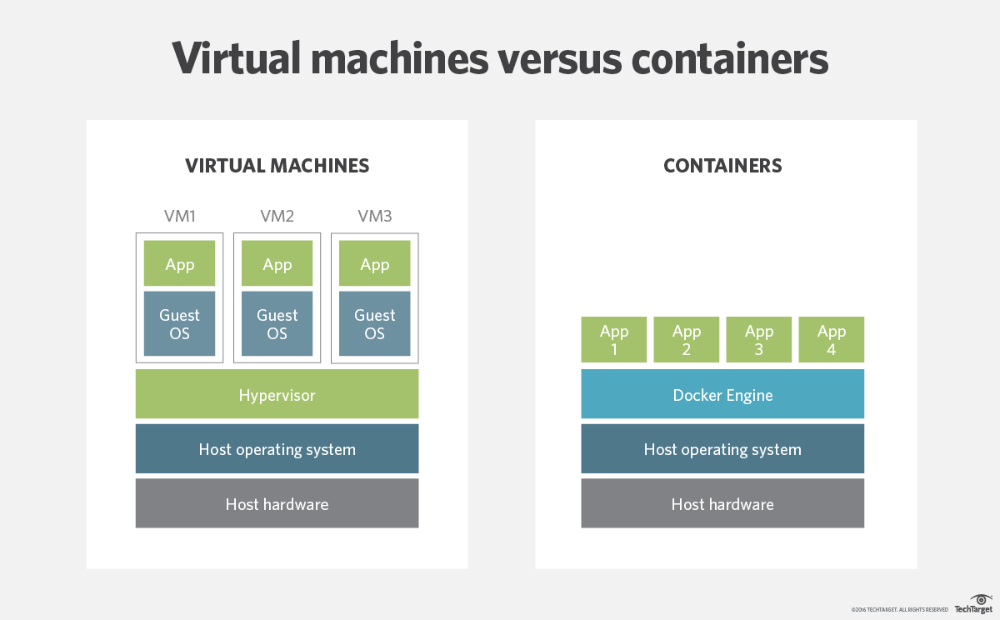

# Containerisation with Docker

## What is Docker

- Docker is an open-source platform
- It enables us to separate applications from the infrastructure
- It allows to deliver software faster
- Docker is written in GO language

[Docker is an open platform](https://docs.docker.com/get-started/overview/) for developing, shipping, and running applications. Docker enables you to separate your applications from your infrastructure so you can deliver software quickly. With Docker, you can manage your infrastructure in the same ways you manage your applications. By taking advantage of Docker’s methodologies for shipping, testing, and deploying code quickly, you can significantly reduce the delay between writing code and running it in production.

### Why Docker

- Multi-billion dollar companies are using or adapting Docker
- Docker adoption is anticipated by 50% by the end of 2020

### Virtual Machines vs. Docker

- Docker is lightweight and user-friendly
- Docker shares the resources of OS as opposed to using the OS completely
- Docker engine connects the container with the OS and only uses the resources required
- VM works with Hypervisor to connect guest OS/VM with Host OS

### Demand and Future of Docker

### Docker API

