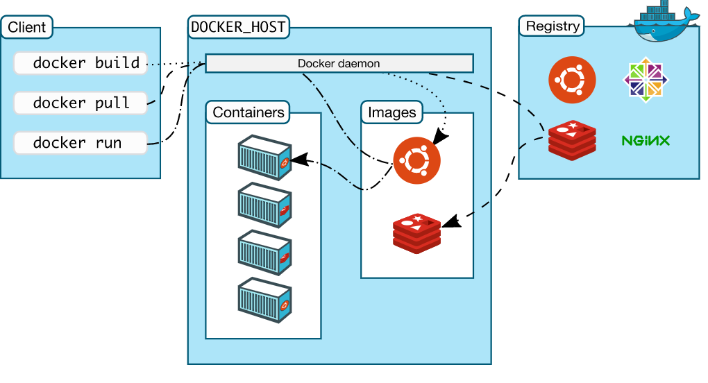

# Containerisation with Docker

## What is Docker

- Docker is an open-source platform
- It enables us to separate applications from the infrastructure
- It allows to deliver software faster
- Docker is written in GO language

[Docker is an open platform](https://docs.docker.com/get-started/overview/) for developing, shipping, and running applications. Docker enables you to separate your applications from your infrastructure so you can deliver software quickly. With Docker, you can manage your infrastructure in the same ways you manage your applications. By taking advantage of Docker’s methodologies for shipping, testing, and deploying code quickly, you can significantly reduce the delay between writing code and running it in production.

### Why Docker

- Multi-billion dollar companies are using or adapting Docker
- Docker adoption is anticipated by 50% by the end of 2020

### Virtual Machines vs. Docker

- Docker is lightweight and user-friendly
- Docker shares the resources of OS as opposed to using the OS completely
- Docker engine connects the container with the OS and only uses the resources required
- VM works with Hypervisor to connect guest OS/VM with Host OS


### Demand and Future of Docker

### Docker API




### Docker Commands

- ``docker pull <image_name>``
- ``docker run <image_name>`` (``hello-world`` to pull and run hello-world to ensure everything installed correctly)
- ``docker images`` to see available images
- ``docker build -t <image_name>``
- ``docker commit <image_name>/<container-id>``
- ``docker start <container-id>``
- ``docker stop <container-id>``
- ``docker rm <container-id>``
- ``docker image rm <image_name>``
- ``docker ps and ps -a``` to check the existing containers

```
docker run -d -p 80:80 <image_name>
```
- ``-d``: Detached, by design, containers started in detached mode exit when the root process used to run the container exits, unless ``--rm`` is also specified
- ``-p``: To explicitly map a single port or range of ports

For documentation to be available on localhost
```docker run -d -p 4000:4000 docs/docker.github.io```

- ``docker cp <filename> <container_id>:dir/to/path`` to copy files from local to container
### Logging into a Running Container

``docker exec -it <image_name>/<container-id>``

**FOR WINDOWS RUN FIRST**
```
alias docker="winpty docker"
```

### DockerHub

- Repository name and local folder name must match
- Commit to save changes to image, then push to dockerhub (will default tag to "latest")
```
docker commit <container_id> ldaijiw/repo_name
docker push ldaijiw/repo_name
```

